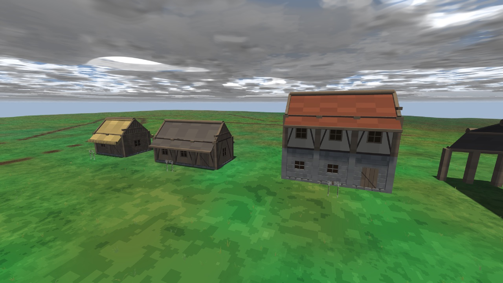
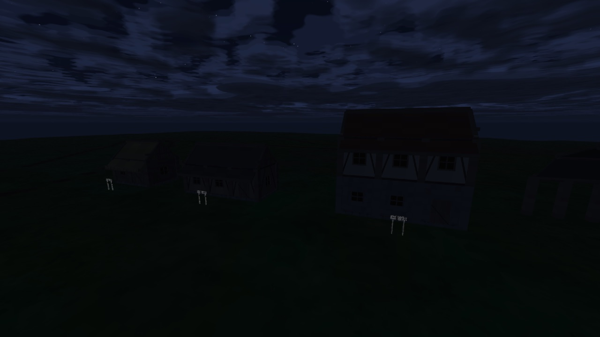
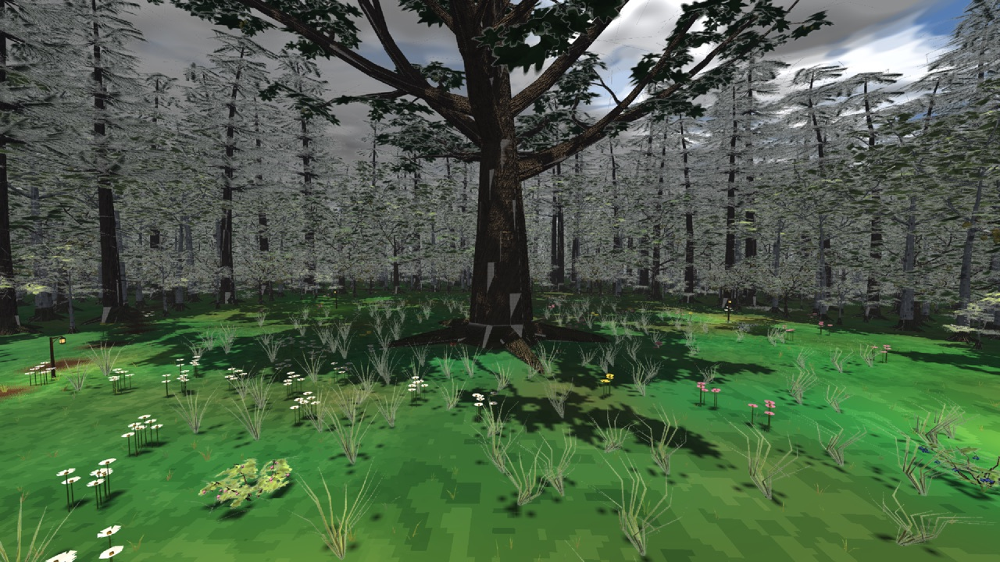
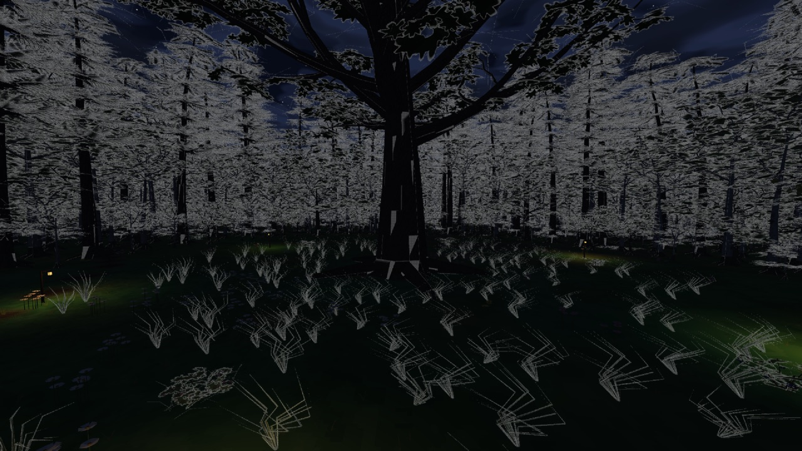

# Yaan — блог разработки

| | |
|:---:|:---:|
|  |  |
|  |  |

*Демка домов и полянка с дубом-старейшиной, день и ночь. Кадры сняты из игры.*

## Что это

Ролевая игра от первого лица в духе старших Elder Scrolls — Daggerfall и Morrowind: свобода передвижения, дом, в который заходишь, лес, по которому идёшь, и мир, сделанный руками, а не сгенерированный на лету.

- **Мир конечный и сюжетный.** Всё содержимое печётся заранее и раскладывается по картам; в игре ничего не генерируется.
- **Дома из деталей.** На полке больше двух тысяч деталей — брус, доска, фронтон, скат, лестница, дверь, окно. Дом — композиция в текстовом файле.
- **Персонажи как в жизни.** Тела из MakeHuman, риг, походка с ногами на земле, взгляд, реакция на рельеф.

Игра работает на движке [dfn](https://github.com/SpiralGameStudios/dfn-devlog).

## Статус — сентябрь 2026

- Yaan живёт в своём репозитории и подключает движок как библиотеку; сборка из чистого клона зелёная, 124 теста.
- Пока проект **заморожен** в пользу первого релиза Dusk UnFair: идут только правки движка и долги, которые касаются обеих игр.
- В работе: рест-поза персонажей (ноги вертикальнее, стойка уже), масштаб тел, съёмка стендов без вмешательства в рабочий стол разработчика.

## Планы

1. Основа игры отдельно от монолита: правила, статы и квесты на каркасе движка.
2. Экран «меню → карта» как первая проверяемая дорожка игрока.
3. Возврат к контенту после первого релиза Dusk UnFair.

## Записи

- **2026-09-25.** Yaan — отдельный репозиторий. Движок, редактор и Dusk из него ушли; остались мир, дома, персонажи, карты и инструменты выпечки контента.
- **2026-09-16.** Стенды персонажей и просмотрщик моделей переехали в тесты игры; кадры совпадают побитово.
